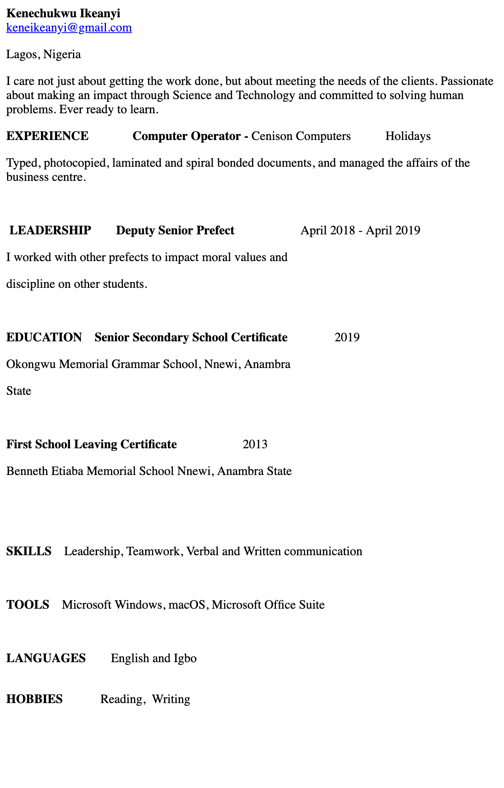

HTML is a standard markup language. It has tags such as paragraph,title,table etc.
In HTML, 
 represents paragraph. It is used to structure a web page.

HTML begins with a start tag and ends with an end tag with the word contained in between the tags example:<h1>Hello Nigerians</h1>
HTML is the simplest

comment tags are used to insert comments in the comment space.

